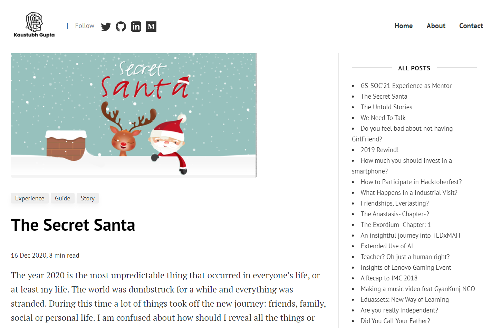

Basado en [blog.kaustubhgupta.me](https://blog.kaustubhgupta.me/)

A Jekyll-themed blog website powered by Ruby and GitHub Pages. The website is configurable via `config.yml`. All my nontech articles that were published on Wix are reposted here. Now onwards, non-tech articles will be published under this website.

## Adding New Author

All the relevant details with respect to the Author can be added in the `config.yml` file under the `Authors` section.

## Adding New Blog Post
- `_posts` folder holds all the blogpost content
- Each file has to be named as `YY-MM-DD-title-in-.md`
- Every post markdown file should have the following configuration table at the top:

```
---
layout: post
title:  "Title"
author: author-name
categories: [cat1, cat2, ...]
image: assets/thumbnails/<image-name-with-extension>
comments: true/false
---
```

## Gallery




## License

[](https://choosealicense.com/licenses/mit/)
